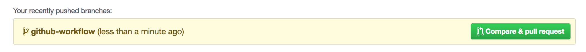
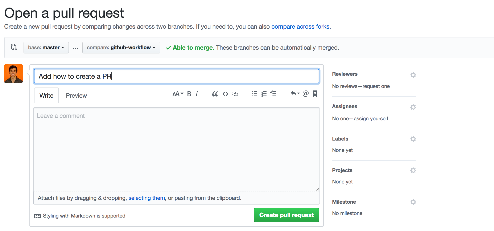
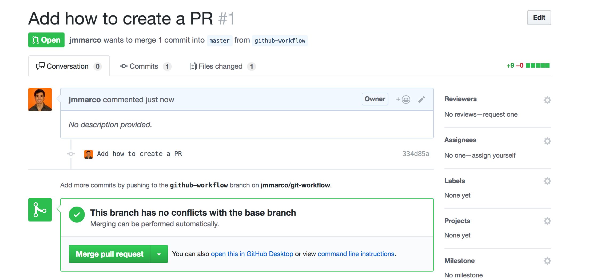
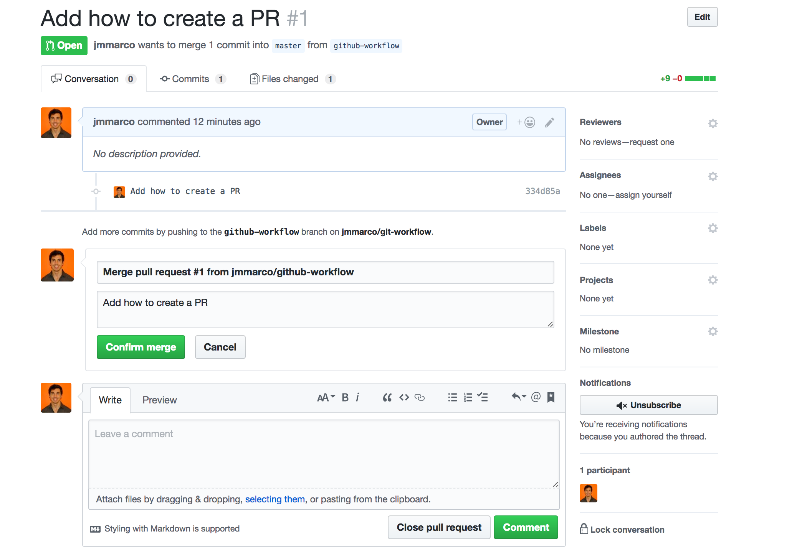
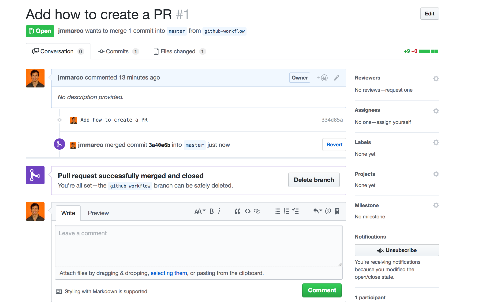

# Feature Branch Workflow

Common commands:

- `git status`
- `git log`
- `git branch`


Notice that the "Local" refers to your computer and "GitHub" refers to your GitHub account

## Initial Setup

### 1. Local
- Create a local working directory in your computer
- Initialize the folder using the command: `git init`
- Create the necessary files and folders

### 2. GitHub
- Create a repository (the name can be different from the local folder)
- Copy the remote URL given to you when you create a repository. It looks something like this:
```
git remote add origin https://github.com/user/my-portfolio.git
```


### 3. Local
- Add the remote to your local repository: `git remote add https://github.com/user/my-repository.git`

### 4. Local
- Add the basic file and folder structure: `git add .`
- Create an initial commit: `git commit -m "Add basic file and folder structure"`

### 4. Local
- Push the commit to the **master** branch on GitHub: `git push origin master`

### 5. Local
- Create a "feature" branch so you can start making the necessary changes: `git checkout -b my-portfolio`
- You can check where you're standing by typing `git branch`
- You can move beteen branches by typing:
```
git checkout my-portfolio
```
to move back:
```
git checkout master
```


## Normal workflow (Local)

### How to add files:
- `git add your-file-name.html`
or
- `git add .` (to include all the files inside the folder structure, use with caution)


### How to create a commit (you must add files to the staging area first)
- `git commit -m "some brief descriptive message"`

**Remember**:You can make as much commits as you want (one for each file, or one for a bunch of files, you decide which one). As a general rule commit as often as you can. Especially when you finished implementing a feature.

### How to undo a local commit you already did
Type: `git reset HEAD~`
- The file will be unstaged and ready to be committed again. You can now make more changes or redo the commit


### How to push
- `git push origin my-portfolio`
**Note**: You don't need to push every time you make a commit. For example you can make several commits and then push the changes to GitHub later. Once you push to GitHub all commits and branches will be pushed to your online GitHub repository


## GitHub Workflow (GitHub)
Now that you pushed the changes (commits) to your feature branch. You will need to merge it into master.

1. Compare pull request it will appear on the main window of your GitHub repository:

2. Create the pull request (click "compare and pull request")

3. Merge the pull request into the `master` branch.

4. Confirm the merge

5. Delete the branch (optional, helps keeps things clean)



## Git Workflow (Local)
You now need to get (pull) the changes to your local `master` branch
1. On your local repository type: `git checkout master`
2. Then make the pull request: `git pull`
3. Local master is now updated

Congratulations, you're done!

You can now start a new branch to add a new feature.

